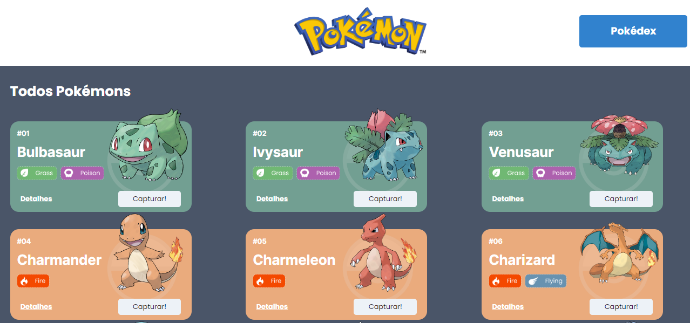
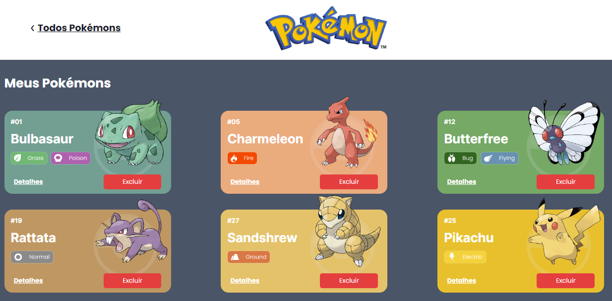
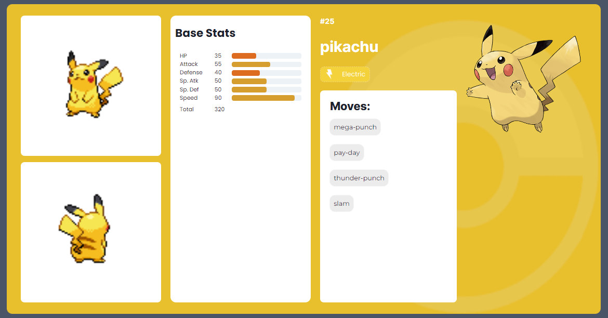

# **Projeto Pokédex** 
A Pokedéx é um site de pokémons, onde o usuário pode escolher seus pokémons preferidos e adicioná-los para a sua Pokédex. O usuário pode escolher através do seu conhecimento prévio ou também pesquisar cada um na página de detalhes para ver qual deles tem os melhores rendimentos.

Este projeto teve como fonte de dados para a sua criação a [Poke Api](https://pokeapi.co/ "Poke Api"), uma Api pública, muito usada para aplicações focadas em aprendizado de programação.

## Índice

- [Funcionalizades do Projeto](#⚙️-funcionalidades-do-projeto)
- [Layout](#💻-layout)
- [Demonstração](#💻-demonstração)
- [Tecnologias Utilizadas](#👩🏽‍💻-tecnologias-utilizadas)
- [Contato](#👩🏽‍🦱-meu-contato)

## ⚙️ Funcionalidades do Projeto

- [x] Capturar Pokémons
- [x] Adicioná-los à Pokédex
- [x] Removê-los da Pokédex
- [x] Visualizar os detalhes dos Pokémons

## 💻 Layout

## 💻 Demonstração

[Link demonstração](https://projeto-react-apis-weld.vercel.app/)

## 👩🏽‍💻 Tecnologias Utilizadas

- React
- React Router
- React Context
- Axios
- Chakra UI

## 👩🏽‍🦱 Contato

